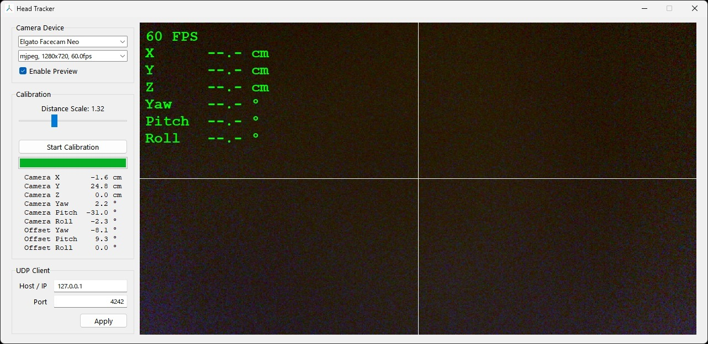

# CamHeadTracker

Webカメラを使用して、頭部の動きを6DoF（X, Y, Z, Yaw, Pitch, Roll）でトラッキングし、そのデータをUDP経由で [opentrack](https://github.com/opentrack/opentrack) へ送信するアプリケーションです。



## ✨特徴

- **高精度ヘッドトラッキング**: オフラインで動作する MediaPipe Face Landmark Detection を使用
- **キャリブレーション機能**: カメラの設置位置を頭部の動きから算出し、出力座標をモニター基準に補正
- **UDP送信**: opentrack の入力として使用可能

## 💻動作環境

- **OS**: Windows 10 / 11 (64bit)
- **Webカメラ**: 解像度 640x360 以上、30 FPS 以上を推奨

> [!TIP]
>
> - Android 14 以降のスマートフォンは、Android の標準機能で USB Web カメラにできます。
> - 遅延を防ぐため、USB 3.0 以上での接続を推奨します。

## 🚀使い方

1. **ダウンロード**: [Releases](https://github.com/shiguruikai/cam-head-tracker/releases) から最新の `CamHeadTracker-vX.X.X.zip` をダウンロードし、展開します。
2. **起動**: `CamHeadTracker.exe` を実行します。
3. **カメラ選択**: [Camera Device] で使用するカメラと解像度を選択します。
4. **opentrack の設定**:
    1. opentrack を起動し、[Input] で `UDP over network` を選択します。
    2. 右横の🔨ボタンをクリックし、Port の番号を確認します。（デフォルト: `4242`）
    3. CamHeadTracker 側の Port に同じ番号を入力し、[Apply] ボタンをクリックします。

> [!NOTE]
>
> Microsoft Flight Simulator 2024 で使うには、opentrack の [Output] で `freetrack 2.0 Enhanced` を選択します。

### キャリブレーション手順

精度を最大限に引き出すために、以下の手順でキャリブレーションを行ってください。

1. **距離の調整**: [Distance Scale] をスライダーで調整し、画面上の `Z` の値が、実際のカメラから顔までの距離（cm）とだいたい一致するようにします。
2. **計測開始**: [Start Calibration] ボタンをクリックします。
3. **水平に動く**: モニターの正面を向いたまま、首を動かさずゆっくりと前方または後方へ移動（15cm 〜 30cm 程度）します。
    - **注意**: カメラが横にある場合でも、カメラを見るのではなく、モニターの正面を向いたまま真っ直ぐ前か後ろへ移動してください。
4. **完了**: プログレスバーがいっぱいになるとカメラの位置と角度が自動で計算され、頭の動きがモニター基準に補正されます。

### 🔍トラブルシューティング

- **FPSが低い**: カメラの解像度を下げてみてください。
- **CPU使用率が高い**: [Enable Preview] のチェックを外すとプレビューが非表示になり、CPU 使用率は若干低下します。
- **動きが逆になる**: opentrack 側の [Options] > [Output] タブで、各軸 Invert（反転）設定を行ってください。
- **感度が高い**: opentrack 側の [Mapping] や [Filter] で感度を調整してください。
- **中心位置の初期化**: キャリブレーション完了後、視点がズレている場合は、opentrack 側の「Center」ショートカットキー（[Options] > [Shortcuts] タブで設定可能）を使用して位置をリセットしてください。

## 🛠️開発者向け情報

### 前提

Python パッケージマネージャー: [uv](https://github.com/astral-sh/uv)
タスクランナー: [task](https://taskfile.dev/) または [Taskfile.yml](Taskfile.yml) に定義されているコマンドを直接実行

### ビルド手順

```bash
# リポジトリのクローン
git clone https://github.com/shiguruikai/cam-head-tracker.git
cd cam-head-tracker

# 依存関係のインストール
task setup

# ビルド
task build
```

ビルド成果物は `dist/CamHeadTracker` ディレクトリに出力されます。

### その他のコマンド

```bash
# アプリケーションの実行
task run

# リント
task lint

# フォーマット
task format

# テスト
task test
```

### MediaPipe モデルの更新

[Face landmark detection guide | Google AI Edge](https://ai.google.dev/edge/mediapipe/solutions/vision/face_landmarker) から最新の `face_landmarker.task` をダウンロードし、`cam_head_tracker/assets/face_landmarker.task` に配置します。

### `ffmpeg.exe` の更新

本アプリは、Webカメラの情報および映像取得に `ffmpeg.exe` を使用しており、必要最小限の機能のみを有効化したカスタムビルド版を同梱しています。

#### 自動更新

GitHub Actions のワークフローで FFmpeg の最新安定版を定期的にチェックします。新しいバージョンがリリースされている場合、自動でビルドしてプルリクエストを作成します。

#### 手動更新

1. Docker を実行できる環境に `ffmpeg-builder` ディレクトリを配置します。
2. ビルド対象のバージョン（FFmpeg のリポジトリにおけるタグまたはブランチ名）を `ffmpeg-builder/version` に記述します。
3. スクリプトを実行してビルドします。

    ```bash
    cd ffmpeg-builder
    chmod +x build.sh
    ./build.sh
    ```

4. 生成された `out/ffmpeg.exe` を `cam_head_tracker/assets/ffmpeg.exe` に配置します。

## 🐛バグ報告と貢献

個人使用の目的で公開したのですが、興味を持っていただきありがとうございます。バグ報告やご質問等あれば Issues でご連絡ください。

## 📝ライセンス

[MIT License](LICENSE.txt)

本アプリの動作には以下のライブラリが含まれています。

- FFmpeg (Custom build): [LGPL v2.1](ffmpeg-builder/LICENSE_FFMPEG.txt)
- Third-Party Notices: [NOTICE.txt](NOTICE.txt)
